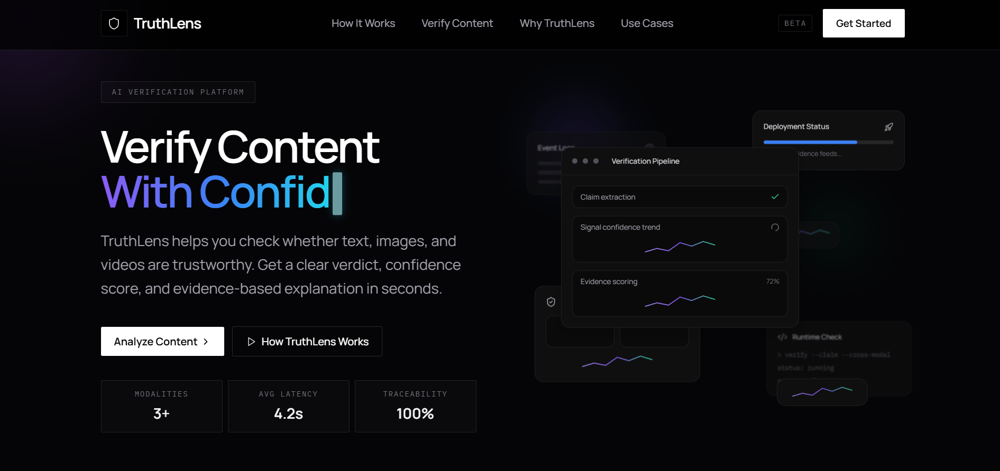

<div align="center">

# TruthLens AI

### See through the noise.

**A startup-grade multimodal verification platform for text, image, video, and combined content.**

*Fast, explainable, and evidence-driven verification powered by Agentic RAG + AI reasoning.*


</div>

---

## 🎥 Demo / Preview

[](https://truth-lens-ai-two.vercel.app/)

Click the image to open the live homepage.

---

## ⚡ Quick Start

Run the project quickly with the essentials:

```bash
git clone <your-repo-url>
cd "TruthLens AI"

python -m venv venv
.\venv\Scripts\activate
pip install -r requirements.txt

cd backend
python run.py

# in a new terminal
cd frontend
npm install
npm run dev
```

---

## 🚀 Overview
TruthLens AI helps users verify suspicious content in a simple, practical workflow.

Instead of only searching keywords, it runs a full verification pipeline:
- Extracts claims from text
- Analyzes media signals (visual/audio/motion)
- Retrieves supporting evidence from trusted sources
- Produces a clear verdict with explanation and references

It is built for real-world misinformation checks, deepfake suspicion, newsroom triage, and fast decision support.

---

## ✨ Features
- 🧾 **Text Verification**: Convert raw claims into evidence-backed verdicts, quickly.
- 🖼️ **Image Analysis**: Detect synthetic patterns and extract meaningful visual context.
- 🎬 **Video Analysis**: Combine frame, audio, and motion signals to flag manipulation risk.
- 🧠 **Agentic RAG**: Use smarter, shorter, context-aware queries for better retrieval quality.
- 🔍 **Evidence You Can Use**: Get source links with readable notes, not noisy dumps.
- ⚡ **Production-Ready Reliability**: Async-safe, timeout-bounded, fallback-protected pipeline.
- 🧱 **Deterministic Verdict Core**: Consistent `TRUE` / `FALSE` decisions with confidence scoring.
- 🎯 **Human-Readable Explanations**: ChatGPT-style summary, key points, and short technical notes.

---

## 🔄 System Flow

```text
User Input → Media/Text Analysis → Agentic RAG Retrieval → Verdict Engine → Clear Explanation + Sources
```

Step view:
1. **User Input** submits text/image/video/combined content.
2. **Analysis Layer** extracts claims and media signals.
3. **RAG Layer** retrieves and filters relevant evidence.
4. **Verdict Layer** computes final decision and confidence.
5. **Explanation Layer** generates a user-friendly result with supporting sources.

---

## 🧠 How It Works
1. **Input**: User submits text, image, video, or mixed content.
2. **Preprocessing**: Claims are extracted; media metadata/features are analyzed.
3. **Query Planning**: RAG generates short, context-aware search queries.
4. **Retrieval**: System gathers evidence from web/wiki/news sources.
5. **Filtering + Ranking**: Irrelevant/noisy evidence is removed.
6. **Reasoning**: LLM + deterministic logic produce verdict and confidence.
7. **Explanation**: User gets a clear explanation, key points, and source links.

---

## 🛠️ Tech Stack

### Backend
- **FastAPI** + **Uvicorn**
- **Python** (async pipeline)
- **Groq API** (LLM reasoning)
- **httpx** (async HTTP)
- **slowapi** (rate limiting)
- **python-magic-bin** (MIME validation)
- **OpenCV / Torch / timm / transformers** (media analysis)
- **pytesseract / librosa / moviepy** (OCR/audio/video)

### Frontend
- **React 18** + **TypeScript**
- **Vite**
- **Tailwind CSS**
- **Radix UI components**

### Retrieval & Evidence
- **Tavily API**
- **Wikipedia API**
- Curated fallback references (Reuters, BBC)

---

## 📁 Project Structure
```bash
TruthLens AI/
├── backend/
│   ├── run.py
│   └── app/
│       ├── main.py
│       ├── api/
│       │   └── verify.py
│       ├── core/
│       │   ├── claim_extractor.py
│       │   ├── text_verifier.py
│       │   ├── image_analyzer.py
│       │   ├── video_analyzer.py
│       │   ├── audio_analyzer.py
│       │   └── verdict_engine.py
│       ├── rag/
│       │   └── agentic_rag.py
│       ├── live/
│       │   └── live_search.py
│       ├── llm/
│       │   └── evaluator.py
│       └── utils/
│           ├── explanation_tree.py
│           └── serialization.py
├── frontend/
│   ├── src/
│   │   ├── components/
│   │   ├── services/
│   │   ├── types/
│   │   └── App.tsx
│   ├── package.json
│   └── vite.config.ts
├── requirements.txt
└── README.md
```

---

## ⚙️ Installation & Setup

### Prerequisites
- Python 3.9+
- Node.js 18+
- Tesseract OCR installed and available in system `PATH`

### 1) Clone the project
```bash
git clone <your-repo-url>
cd "TruthLens AI"
```

### 2) Backend setup
```bash
# from project root
python -m venv venv

# Windows
.\venv\Scripts\activate

# macOS/Linux
source venv/bin/activate

pip install -r requirements.txt
```

Create a root `.env` file:
```env
GROQ_API_KEY=gsk_your_api_key_here
TAVILY_API_KEY=tvly_your_api_key_here
# Optional
# ALLOWED_ORIGINS=http://localhost:8080
```

### 3) Frontend setup
```bash
cd frontend
npm install
```

---

## ▶️ How to Run the Project

### Terminal A: Backend
```bash
cd backend
python run.py
```
Backend runs on: `http://127.0.0.1:9000`

### Terminal B: Frontend
```bash
cd frontend
npm run dev
```
Frontend runs on: `http://localhost:8080`

> Vite proxy is preconfigured so `/api/*` calls go to backend `127.0.0.1:9000`.

---

## 🧪 Example Usage

### Text
1. Open the app.
2. Select **Text** tab.
3. Paste a claim.
4. Click **Run Verification**.

### Image
1. Select **Image** tab.
2. Upload an image (`jpg/png/webp/gif`).
3. Run verification.

### Video
1. Select **Video** tab.
2. Upload a supported video (`mp4/mpeg/mov/avi`).
3. Run verification.

### Combined
1. Select **Combined** tab.
2. Enter text + optional image.
3. Run verification.

---

## 📊 Output Format

Each verification returns a product-ready response with verdict, confidence, explanation, and evidence sources.

```json
{
  "verdict": "TRUE",
  "status": "TRUE",
  "confidence": 82,
  "explanation": {
    "summary": "✅ This content appears to be real.",
    "key_points": [
      "Claim matches trusted cross-source references",
      "No strong synthetic/manipulation signals detected",
      "Context and timeline are consistent"
    ],
    "technical": "Technical note: weighted evidence and model consistency checks support this verdict."
  },
  "sources": [
    {
      "title": "Reuters Search",
      "url": "https://www.reuters.com/site-search/?query=...",
      "note": "Credible news reporting search results."
    }
  ]
}
```

What users experience in the UI:
- Clear verdict badge
- Confidence score with justification
- Natural-language explanation
- Source cards with links and short notes

---

## 🔐 Reliability & Safety Highlights
- Strict file size + MIME validation for uploads
- Rate limits on verification endpoints
- Timeout-bounded async retrieval and reasoning
- Circuit-breaker style fallback behavior for unstable providers
- Graceful error handling with deterministic fallback verdicts

---

## 🧩 Future Improvements
- Browser extension for one-click verification
- Source credibility scoring model
- Better multilingual claim extraction
- Batch verification mode for newsroom workflows

---

## 🤝 Contribution
Contributions are welcome.

1. Fork the repo
2. Create a feature branch
3. Commit your changes
4. Open a pull request

---

## 📜 License
This project is licensed under the **MIT License**.

---

### ⭐ If this project helps you, consider starring the repository.
